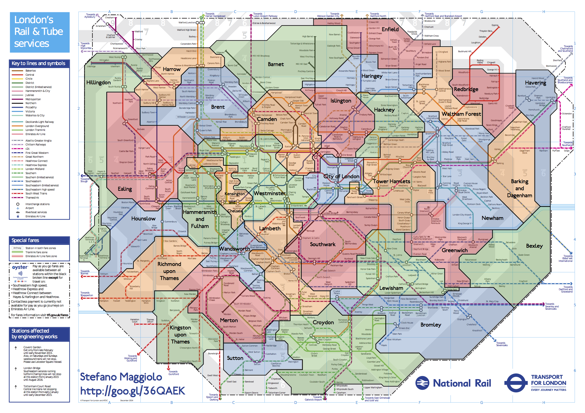

```{r warning = FALSE, message = FALSE, echo=FALSE}
library(dplyr)
library(ggplot2)
library(kableExtra)
library(tidyverse)
library(readxl)
library(tidyr)
library(data.table)
library(plotly)

```
```{r warning = FALSE, message = FALSE, echo=FALSE}
path8<-"C:/Users/tobbi/Desktop/Tube_London_Metro/multi-year-station-entry-and-exit-figures incl 2017.xlsx"
#évolution des entrées de métro de 2009 à 2017 /stations

#Note du fichier
mysefNote<-read_xlsx(path8, sheet = 1)


#Year 2017
mysef2017<-read_xlsx(path8, sheet = 2, skip = 6, n_max = 268)
#Renaming columns
names(mysef2017)[1]<-"nlc"
names(mysef2017)[2]<-"Station"
names(mysef2017)[3]<-"Borough"
names(mysef2017)[4]<-"Note"
names(mysef2017)[5]<-"Weekday_Entry"
names(mysef2017)[6]<-"Saturday_Entry"
names(mysef2017)[7]<-"Sunday_Entry"
names(mysef2017)[8]<-"Weekday_Exit"
names(mysef2017)[9]<-"Saturday_Exit"
names(mysef2017)[10]<-"Sunday_Exit"
names(mysef2017)[11]<-"Annual_Entry_Exit_million"
#Adding New column Year
Year<-2017
mysef2017<-cbind(mysef2017, Year)

#mysef2r<-reshape(mysef2, varying = c("Weekday_Entry", "Saturday_Entry", "Sunday_Entry", "Weekday_Exit", "Saturday_Exit", "Sunday_Exit"), direction = "long", sep="_")

#Year 2016

mysef2016<-read_xlsx(path8, sheet = 3, skip=6, n_max=268)
#Renaming columns
names(mysef2016)[1]<-"nlc"
names(mysef2016)[2]<-"Station"
names(mysef2016)[3]<-"Borough"
names(mysef2016)[4]<-"Note"
names(mysef2016)[5]<-"Weekday_Entry"
names(mysef2016)[6]<-"Saturday_Entry"
names(mysef2016)[7]<-"Sunday_Entry"
names(mysef2016)[8]<-"Weekday_Exit"
names(mysef2016)[9]<-"Saturday_Exit"
names(mysef2016)[10]<-"Sunday_Exit"
names(mysef2016)[11]<-"Annual_Entry_Exit_million"
#Adding New column Year
Year1<-2016
mysef2016<-cbind(mysef2016, Year1)
names(mysef2016)[12]<-"Year"

#mysef3r<-reshape(mysef3, varying = c("Weekday_Entry", "Saturday_Entry", "Sunday_Entry", "Weekday_Exit", "Saturday_Exit", "Sunday_Exit"), direction = "long", sep="_")

#Year 2015
mysef2015<-read_xlsx(path8, sheet = 4, skip=6)
#Renaming columns
names(mysef2015)[1]<-"nlc"
names(mysef2015)[2]<-"Station"
names(mysef2015)[3]<-"Borough"
names(mysef2015)[4]<-"Note"
names(mysef2015)[5]<-"Weekday_Entry"
names(mysef2015)[6]<-"Saturday_Entry"
names(mysef2015)[7]<-"Sunday_Entry"
names(mysef2015)[8]<-"Weekday_Exit"
names(mysef2015)[9]<-"Saturday_Exit"
names(mysef2015)[10]<-"Sunday_Exit"
names(mysef2015)[11]<-"Annual_Entry_Exit_million"
#Adding new columns Year
Year2<-2015
mysef2015<-cbind(mysef2015, Year2)
names(mysef2015)[12]<-"Year"


#Year 2014
mysef2014<-read_xlsx(path8, sheet = 5, skip = 6, n_max = 268)
#Renaming columns
names(mysef2014)[1]<-"nlc"
names(mysef2014)[2]<-"Station"
names(mysef2014)[3]<-"Borough"
names(mysef2014)[4]<-"Note"
names(mysef2014)[5]<-"Weekday_Entry"
names(mysef2014)[6]<-"Saturday_Entry"
names(mysef2014)[7]<-"Sunday_Entry"
names(mysef2014)[8]<-"Weekday_Exit"
names(mysef2014)[9]<-"Saturday_Exit"
names(mysef2014)[10]<-"Sunday_Exit"
names(mysef2014)[11]<-"Annual_Entry_Exit_million"
#Adding New column Year
Year3<-2014
mysef2014<-cbind(mysef2014, Year3)
names(mysef2014)[12]<-"Year"


#Year 2013
mysef2013<-read_xlsx(path8, sheet = 6, skip = 6, n_max = 268)
#Renaming columns
names(mysef2013)[1]<-"nlc"
names(mysef2013)[2]<-"Station"
names(mysef2013)[3]<-"Note"
names(mysef2013)[4]<-"Weekday_Entry"
names(mysef2013)[5]<-"Saturday_Entry"
names(mysef2013)[6]<-"Sunday_Entry"
names(mysef2013)[7]<-"Weekday_Exit"
names(mysef2013)[8]<-"Saturday_Exit"
names(mysef2013)[9]<-"Sunday_Exit"
names(mysef2013)[10]<-"Annual_Entry_Exit_million"
#Adding New column Year
Year4<-2013
mysef2013<-cbind(mysef2013, Year4)
names(mysef2013)[11]<-"Year"
mysef2013[,"Borough"] <- NA

#Year 2012
mysef2012<-read_xlsx(path8, sheet = 7, skip = 6, n_max = 268)
#Renaming columns
names(mysef2012)[1]<-"nlc"
names(mysef2012)[2]<-"Station"
names(mysef2012)[3]<-"Note"
names(mysef2012)[4]<-"Weekday_Entry"
names(mysef2012)[5]<-"Saturday_Entry"
names(mysef2012)[6]<-"Sunday_Entry"
names(mysef2012)[7]<-"Weekday_Exit"
names(mysef2012)[8]<-"Saturday_Exit"
names(mysef2012)[9]<-"Sunday_Exit"
names(mysef2012)[10]<-"Annual_Entry_Exit_million"
#Adding new column Year
Year5<-2012
mysef2012<-cbind(mysef2012, Year5)
names(mysef2012)[11]<-"Year"
mysef2012[,"Borough"] <- NA

#Year 2011
mysef2011<-read_xlsx(path8, sheet = 8, skip = 6, n_max = 268)
#Renaming columns
names(mysef2011)[1]<-"nlc"
names(mysef2011)[2]<-"Station"
names(mysef2011)[3]<-"Note"
names(mysef2011)[4]<-"Weekday_Entry"
names(mysef2011)[5]<-"Saturday_Entry"
names(mysef2011)[6]<-"Sunday_Entry"
names(mysef2011)[7]<-"Weekday_Exit"
names(mysef2011)[8]<-"Saturday_Exit"
names(mysef2011)[9]<-"Sunday_Exit"
names(mysef2011)[10]<-"Annual_Entry_Exit_million"
#Adding New column Year
Year6<-2011
mysef2011<-cbind(mysef2011, Year6)
names(mysef2011)[11]<-"Year"
mysef2011[,"Borough"] <- NA

#Year 2010
mysef2010<-read_xlsx(path8, sheet = 10, skip = 6, n_max = 268)
#Renaming columns
names(mysef2010)[1]<-"nlc"
names(mysef2010)[2]<-"Station"
names(mysef2010)[3]<-"Note"
names(mysef2010)[4]<-"Weekday_Entry"
names(mysef2010)[5]<-"Saturday_Entry"
names(mysef2010)[6]<-"Sunday_Entry"
names(mysef2010)[7]<-"Weekday_Exit"
names(mysef2010)[8]<-"Saturday_Exit"
names(mysef2010)[9]<-"Sunday_Exit"
names(mysef2010)[10]<-"Annual_Entry_Exit_million"
#Adding New column Year
Year8<-2010
mysef2010<-cbind(mysef2010, Year8)
names(mysef2010)[11]<-"Year"
mysef2010[,"Borough"] <- NA

#Year 2009
mysef2009<-read_xlsx(path8, sheet = 11, skip = 6, n_max = 268)
#Renaming columns
names(mysef2009)[1]<-"nlc"
names(mysef2009)[2]<-"Station"
names(mysef2009)[3]<-"Note"
names(mysef2009)[4]<-"Weekday_Entry"
names(mysef2009)[5]<-"Saturday_Entry"
names(mysef2009)[6]<-"Sunday_Entry"
names(mysef2009)[7]<-"Weekday_Exit"
names(mysef2009)[8]<-"Saturday_Exit"
names(mysef2009)[9]<-"Sunday_Exit"
names(mysef2009)[10]<-"Annual_Entry_Exit_million"
#Adding New column Year
Year9<-2009
mysef2009<-cbind(mysef2009, Year9)
names(mysef2009)[11]<-"Year"
mysef2009[,"Borough"] <- NA

# Year 2008
mysef2008<-read_xlsx(path8, sheet = 12, skip = 6, n_max = 268)
#Renaming columns
names(mysef2008)[1]<-"nlc"
names(mysef2008)[2]<-"Station"
names(mysef2008)[3]<-"Note"
names(mysef2008)[4]<-"Weekday_Entry"
names(mysef2008)[5]<-"Saturday_Entry"
names(mysef2008)[6]<-"Sunday_Entry"
names(mysef2008)[7]<-"Weekday_Exit"
names(mysef2008)[8]<-"Saturday_Exit"
names(mysef2008)[9]<-"Sunday_Exit"
names(mysef2008)[10]<-"Annual_Entry_Exit_million"
#Adding New column Year
Year10<-2008
mysef2008<-cbind(mysef2008, Year10)
names(mysef2008)[11]<-"Year"
mysef2008[,"Borough"] <- NA

#Year 2007
mysef2007<-read_xlsx(path8, sheet = 13, skip = 6, n_max = 268)
#Renaming columns
names(mysef2007)[1]<-"nlc"
names(mysef2007)[2]<-"Station"
names(mysef2007)[3]<-"Note"
names(mysef2007)[4]<-"Weekday_Entry"
names(mysef2007)[5]<-"Saturday_Entry"
names(mysef2007)[6]<-"Sunday_Entry"
names(mysef2007)[7]<-"Weekday_Exit"
names(mysef2007)[8]<-"Saturday_Exit"
names(mysef2007)[9]<-"Sunday_Exit"
names(mysef2007)[10]<-"Annual_Entry_Exit_million"
#Adding New column Year
Year11<-2007
mysef2007<-cbind(mysef2007, Year11)
names(mysef2007)[11]<-"Year"
mysef2007[,"Borough"] <- NA

station_borough <- mysef2017 %>%
  select("Station", "nlc", "Borough")

#merging all Year dataframe into one
usage_station_year<-merge(mysef2017, mysef2016, by = c("Station", "Borough", "nlc", "Weekday_Entry", "Saturday_Entry", "Sunday_Entry", "Weekday_Exit", "Saturday_Exit", "Sunday_Exit", "Note", "Annual_Entry_Exit_million", "Year"), all=TRUE)
usage_station_year<-merge(usage_station_year, mysef2015, by = c("Station", "Borough", "nlc", "Weekday_Entry", "Saturday_Entry", "Sunday_Entry", "Weekday_Exit", "Saturday_Exit", "Sunday_Exit", "Note", "Annual_Entry_Exit_million", "Year"), all =TRUE)
usage_station_year<-merge(usage_station_year, mysef2014, by = c("Station", "Borough", "nlc", "Weekday_Entry", "Saturday_Entry", "Sunday_Entry", "Weekday_Exit", "Saturday_Exit", "Sunday_Exit", "Note", "Annual_Entry_Exit_million", "Year"), all =TRUE)
usage_station_year<-merge(usage_station_year, mysef2013, by = c("Station", "Borough", "nlc", "Weekday_Entry", "Saturday_Entry", "Sunday_Entry", "Weekday_Exit", "Saturday_Exit", "Sunday_Exit", "Note", "Annual_Entry_Exit_million", "Year"), all.y =TRUE, all.x = TRUE)
usage_station_year<-merge(usage_station_year, mysef2012, by = c("Station", "Borough","nlc", "Weekday_Entry", "Saturday_Entry", "Sunday_Entry", "Weekday_Exit", "Saturday_Exit", "Sunday_Exit", "Note", "Annual_Entry_Exit_million", "Year"), all.y =TRUE, all.x=TRUE)
usage_station_year<-merge(usage_station_year, mysef2011, by = c("Station", "Borough","nlc", "Weekday_Entry", "Saturday_Entry", "Sunday_Entry", "Weekday_Exit", "Saturday_Exit", "Sunday_Exit", "Note", "Annual_Entry_Exit_million", "Year"), all.y=TRUE, all.x = TRUE)
usage_station_year<-merge(usage_station_year, mysef2010, by = c("Station", "Borough","nlc", "Weekday_Entry", "Saturday_Entry", "Sunday_Entry", "Weekday_Exit", "Saturday_Exit", "Sunday_Exit", "Note", "Annual_Entry_Exit_million", "Year"), all.y=TRUE, all.x = TRUE)
usage_station_year<-merge(usage_station_year, mysef2009, by = c("Station", "Borough","nlc", "Weekday_Entry", "Saturday_Entry", "Sunday_Entry", "Weekday_Exit", "Saturday_Exit", "Sunday_Exit", "Note", "Annual_Entry_Exit_million", "Year"), all.y=TRUE, all.x = TRUE)
usage_station_year<-merge(usage_station_year, mysef2008, by = c("Station", "Borough","nlc", "Weekday_Entry", "Saturday_Entry", "Sunday_Entry", "Weekday_Exit", "Saturday_Exit", "Sunday_Exit", "Note", "Annual_Entry_Exit_million", "Year"), all.y=TRUE, all.x = TRUE)
usage_station_year<-merge(usage_station_year, mysef2007, by = c("Station", "Borough","nlc", "Weekday_Entry", "Saturday_Entry", "Sunday_Entry", "Weekday_Exit", "Saturday_Exit", "Sunday_Exit", "Note", "Annual_Entry_Exit_million", "Year"), all.y=TRUE, all.x = TRUE)
usage_station_year<-merge(station_borough, usage_station_year, by = "nlc", all.y = TRUE, no.dups=TRUE, suffixes = c("", "_delete") )
usage_station_year<-usage_station_year %>%
  select(-c("Station_delete", "Borough_delete"))

#Year from num to chr
usage_station_year$Year<-as.character(usage_station_year$Year)

```


# Abstract{.tabset}
In this paper, I will study data from London Underground extracted from the following Website: [London underground passengers count data](https://tfl.gov.uk/info-for/open-data-users/our-open-data?intcmp=3671#on-this-page-3)
The data provided will help me to answer the following question:
How to optimize investments and reduce costs of the London Underground Network? To conduct this analysis we will analyze passenger statistics recorded from the underground ticketing system. The data is provided from 2007 to 2017 which will help us to look at the evolution of the number of passengers. We can conclude from the Analysis two different groups of Boroughs. On one hand the London underground core network with Lambeth, the City of London, City of Westminster, Lambeth, Newham, Southwark, and Tower Hamlets. On the other hand, we have identified Boroughs Outside the London underground core network with Three Rivers, Chiltern, Watford, and Epping Forest. 


## London underground Analysis


<h2> Introduction </h2>

From 2007 to 2017 the annual London underground Entry/Exit went from 2.359 to 2.946 billion. We can see (Figure 1) a strong increase of passengers from 2009 to 2015. 2016 was the best year in terms of Tube passengers with 2.985 billion annual Entry/Exit. This evolution can be explained by the increase in the London Resident population. Indeed, in 2007 the resident population was close to 7.5 million to almost 9 million residents in 2017. Moreover, London Public transport growth should be positive in the future due to pollution reduction policies and more strict rules for cars in London. In April 2019, the ULEZ (Ultra Low Emission Zone) has been restricting polluting cars to travel in the London center through access charges.


```{r warning = FALSE, message = FALSE, echo=FALSE}
#Annual Entry in million per year
year_annual<-usage_station_year%>%
  group_by(Year)%>%
  summarize(annual_sum=sum(Annual_Entry_Exit_million))

Figure_1<-ggplot(year_annual, aes(Year, annual_sum, group=1))+
  geom_point()+
  geom_line(color="Blue")+
  labs(title="Annual Entry/Exit per Year in million", caption = "Figure 1")
ggplotly(Figure_1)
```

The London underground is operated by Transport For London (TfL). It is also a public transport service financed partly by London city. Thus reducing cost is the only way for public transportation to enhance performance. As the London city Mayor, Sadiq Khan, said: "TfL fares have been frozen for the third year in a row, keeping travel affordable for all Londoners". Transport for London can't increase underground tickets to increase their revenue. The Chief Finance Officer Simon Kilonback adds: "The headline result for 2018/19 is that we have reduced our net cost of operations to £494m, compared to £1.516m in 2015/16". It shows how much effort TfL is implementing to reduce their cost of operations, it represents a 66% reduction in the net cost of operations since 2015/16. 

From the TfL Annual Report and Statement of Accounts 2018/19, we understand that reducing cost is one of the main goals of public transportation and more precisely for Transport for London. A study from Reinhold (2008) shows that public transport in Berlin got the same goal & objectives as TfL. The Berliner Verkehrsbetriebe (BVG) increased its revenue by more than 22% in three years by restructuring the transportation network and integrated marketing strategy. Reinhold (2008) shows that with a reducing cost strategy, the best strategy is "improving frequency on the main lines could shorten travel times and attract many new customers to public transportation.". Then he adds "lines outside the core network with little utilization were identified where service could be reduced to achieve significant cost savings with only a slight decline in the number of passengers." 

Based on Reinhold’s (2008) conclusion, we will try to define the core network of London. This study can help TfL to identify areas where to invest and to optimize the London underground. Thus, we will answer the following question: How to optimize investments and reduce costs of the London Underground Network? We will mostly focus our study on London underground passengers count data which is public data from Transport for London. The data provided covers the years 2007 to 2017. From the dataset, I will study passenger flows per station/Borough. It will help me to define the London underground core network and then, areas that are outside the core network.


<h2>Analysis</h2>

<h3>Identifying London core network</h3>

First, we will study the top ten Stations in 2017 by Annual Entry/Exit. We can see in the table below (Figure 2) that King’s Cross St. Pancras in Camden Borough is the first with 97.91 million passengers followed by Waterloo in Lambeth Borough with 91.27 million passengers. We can see that the City of Westminster Borough represents 3 Stations (Oxford Circus, Victoria, Paddington) with the highest Annual Entry/Exit followed by City of London Borough with 2 Stations (Liverpool Street, Bank & Monument).

```{r warning = FALSE, message = FALSE, echo = FALSE}
#Table best 10 Station 2017
top_ten_2017<-usage_station_year %>%
  filter(Year==2017) %>%
  group_by(Station)%>%
  select(Station, Borough, Annual_Entry_Exit_million)%>%
  arrange(desc(Annual_Entry_Exit_million))
kable(head(top_ten_2017, n=10), caption = "Top 10 Stations in 2017 by Annual Entry/Exit in million")%>%
  kable_styling(bootstrap_options = c("striped", "hover", "condensed", "responsive"))

```

We can then deduce the following Boroughs are part of the core network:
<br>
- Camden
<br>
- Lambeth
<br>
- City of Westminster
<br>
- City of London

The graph below (Figure 2) confirms that the City of Westminster Borough has the highest annual Entry/Exit with 655 million passengers in 2017. It is way above Camden, City of London and Lambeth with respectively 308, 242 and 194 millions Annual Entry/Exit. Here we can say that TfL should invest massively in the City of Westminster Borough because it attracts the most passengers in all London's Borough. 

``` {r warning=FALSE, message = FALSE, echo=FALSE}
#Top ten Borough with highest Passenger by year
top_ten_high_borough<-usage_station_year %>%
  group_by(Borough, Year)%>%
  filter(Annual_Entry_Exit_million>0)%>%
  select(Borough, Annual_Entry_Exit_million, Year)%>%
  summarize(sum_annual_million = sum(Annual_Entry_Exit_million, na.rm = TRUE))%>%
  arrange(desc(sum_annual_million))%>%
  ungroup()

Figure_2 <- ggplot(head(top_ten_high_borough, n=50), aes(Year, sum_annual_million, color=Borough, group=Borough))+
  geom_point()+
  geom_line()+
  labs(title="Highest Boroughs Annual Entry/Exit per Year in million", caption = "Figure 2")
ggplotly(Figure_2)

```
We need now to explain why is there a huge gap between the City of Westminster Borough and the other Top Borough having approximately the same range. The gap can be explained by the following table. The city of Westminster has the most Stations with 31 and it is almost twice the Stations of Camden. Thus, more Stations means more passengers, we want to be sure that the City of Westminster Borough remains the core network of London underground

```{r warning=FALSE, message=FALSE, echo=FALSE}
#number of Station by Borough
stationByBorough<-usage_station_year%>%
  group_by(Borough)%>%
  filter(Year==2017)


count_borough_station<-count(stationByBorough)%>%
  arrange(desc(n))

names(count_borough_station)[2]<-"Number_of_Station"

kable(count_borough_station, caption = "Number of Station by Boroughs" )%>%
  kable_styling(bootstrap_options = c("striped", "hover", "condensed", "responsive"), full_width = F, position = "center", fixed_thead = T)%>%
  scroll_box(width = "600px", height = "400px")

```

In order to identify the underground core network, we will use the Number of Station per Borough to weigh the annual Entry/Exit for Borough with more than one station. Now we can see that the City of Westminster is not anymore the Borough with the most Annual Entry/Exit when we weight Stations. Lambeth is now close to the City of London with respectively 24.36 and 24.24 million Annual Entry-Exit by Station in 2017.


```{r warning=FALSE, message=FALSE, echo=FALSE}
#merge count_borough_station & usage_station_year with more than one station

weighted_usage_station_year<- merge(usage_station_year, count_borough_station, by.x= "Borough", by.y = "Borough")

weighted_annual_borough<- weighted_usage_station_year%>%
  group_by(Borough, Year)%>%
  filter(Annual_Entry_Exit_million>0, Number_of_Station>1)%>%
  select(Borough, Annual_Entry_Exit_million, Year, Number_of_Station)%>%
  summarise(annual_weighted = sum(Annual_Entry_Exit_million/Number_of_Station))%>%
  arrange(desc(annual_weighted))%>%
  filter(annual_weighted>15) %>%
  ungroup()

Figure_3 <-ggplot(head(weighted_annual_borough, n=100), aes(Year, annual_weighted, color=Borough, group=Borough))+
  geom_point(aes())+
  geom_line()+
  labs(title="Highest Borough by Station Annual Entry/Exit per Year in million (Borough with more than one Station)", caption = "Figure 3")
  
ggplotly(Figure_3)

```

We can conclude that Lambeth, the City of London, City of Westminster, Lambeth, Newham, Southwark, and Tower Hamlets are Boroughs composing the London Underground core network with the most passengers in 2017. If we look at the Tube maps from resources 3, we can identify that those Boroughs are located in London City Center. Thus, it makes sense that the most Entry/Exit is located in the city center.


<h3> Identifying Boroughs Outside the London core network</h3>

We have identified the London underground core network, now we will identify areas with the lowest annual Entry/Exit. When we look at the table below, Roding Valley and Chigwell from Epping Forest Borough represent 0.36 and 0.49 million Entry/Exit for the year 2017. Epping Forest and Three Rivers are the Boroughs representing 60% of the top 10 Stations. 

```{r warning = FALSE, message = FALSE, echo = FALSE}
#Table lowest 10 Station 2017
top_ten_2017<-usage_station_year %>%
  filter(Year==2017) %>%
  group_by(Station)%>%
  select(Station, Borough, Annual_Entry_Exit_million)%>%
  arrange(Annual_Entry_Exit_million)
kable(head(top_ten_2017, n=10), caption = "Top 10 Stations in 2017 with lowest Annual Entry/Exit in million ")%>%
  kable_styling(bootstrap_options = c("striped", "hover", "condensed", "responsive"))

```

Looking at the graph below we can see that Watford and Chiltern are Boroughs with the lowest number of visitors. Three Rivers and Epping Forest are respectively on positions 3 and 7 of the lowest Boroughs.


```{r warning = FALSE, message = FALSE, echo = FALSE}
#Table lowest 10 Borough 2017
top_ten_low_borough<-usage_station_year %>%
  group_by(Borough, Year)%>%
  select(Borough, Annual_Entry_Exit_million, Year)%>%
  summarize(sum_annual_million = sum(Annual_Entry_Exit_million, na.rm = TRUE))%>%
  arrange(sum_annual_million)%>%
  filter(sum_annual_million<=15 & sum_annual_million>0, Borough!= "NA")%>%
  ungroup()

Figure_5<-ggplot(top_ten_low_borough, aes(Year, sum_annual_million, color=Borough, group=Borough))+
  geom_point()+
  geom_line()+
  labs(title="Lowest Boroughs Annual Entry/Exit per Year in million", caption = "Figure 5")
ggplotly(Figure_5)

```

In order to identify Boroughs outside the core network, we will use the Number of Station per Borough to weigh the annual Entry/Exit for Borough. Three Rivers is now the lowest Boroughs in term of passengers with 1.38 Annual Entry/Exit by Station. Chiltern and Watford are closer than Epping Forest than before with 1.70 and 1.85 versus 2.02 Annual Entry/Exit by Station in 2017.
``` {r warning=FALSE, message=FALSE, echo=FALSE}
#merge count_borough_station & usage_station_year Low

weighted_annual_borough_low<- weighted_usage_station_year%>%
  group_by(Borough, Year)%>%
  filter(Annual_Entry_Exit_million>=0)%>%
  select(Borough, Annual_Entry_Exit_million, Year, Number_of_Station)%>%
  summarise(annual_weighted = sum(Annual_Entry_Exit_million/Number_of_Station))%>%
  arrange(annual_weighted)%>%
  filter(annual_weighted<3)%>%
  ungroup()

Figure_6<-ggplot(head(weighted_annual_borough_low, n=500), aes(Year, annual_weighted, color=Borough, group=Borough))+
  geom_point(aes())+
  geom_line()+
  labs(title="Lowest Borough by Station Annual Entry/Exit per Year in million", caption = "Figure 6")
  
ggplotly(Figure_6)

```
We can conclude that Three Rivers, Chiltern, Watford, and Epping Forest are Boroughs Outside the London Underground core network with lesser passengers in 2017.


<h2>Conclusion</h2>
We can conclude from the Analysis two different groups of Boroughs. On one hand the London underground core network with the City of London, City of Westminster, Lambeth, Newham, Southwark, and Tower Hamlets. On the other hand, we have identified Boroughs Outside the London underground core network with Three Rivers, Chiltern, Watford, and Epping Forest. Transport for London should then invest mostly in Boroughs composed of London core network because they attract new customers. Improving the frequency of lines can improve the satisfaction of passengers. For Boroughs outside the core network, we should avoid investing a lot in these stations because decreasing investments, thus the cost of operation, we will have a slight decrease in the passenger. We should be able to attract more passengers than passengers we lost.  For Reinhold (2008), the major constituent element of public transportation are:
• average speed of public transport vehicles <br>
• intervals between vehicles (i.e., the amount of time spent waiting for the initial vehicle and any subsequent vehicles following transfers) <br>
• number and/or necessity of transfers <br>
• density of stations or stops (i.e., the distance from residence and destination to the nearest station or stop) <br>
Transport for London should focus its investment on the list above. Pollution reducing policies in London City Center will help TfL to gain more passengers, reduce their cost and improve services.

<br>
<br>
<br>
<br>


## Resources

Resources 1:
https://tfl.gov.uk/info-for/open-data-users/our-open-data?intcmp=3671#on-this-page-3
<br>
Resources 2:
ULEZ: https://www.bbc.com/news/uk-england-london-47815117
<br>
Resources 4: 
Reinhold, T. (2008). More Passengers and Reduced Costs—The Optimization of the Berlin Public Transport Network. Journal Of Public Transportation, 11(3), 57-76. doi: 10.5038/2375-0901.11.3.4
<br>
Resources 3:
http://blog.poormansmath.net/images/london_borough_tube.png 


{ width=100%} 

<br>

<h2> Code</h2>

```{r warning = FALSE, message = FALSE}
library(dplyr)
library(ggplot2)
library(kableExtra)
library(tidyverse)
library(readxl)
library(tidyr)
library(data.table)
library(plotly)


path8<-"C:/Users/tobbi/Desktop/Tube_London_Metro/multi-year-station-entry-and-exit-figures incl 2017.xlsx"
#évolution des entrées de métro de 2009 à 2017 /stations

#Note du fichier
mysefNote<-read_xlsx(path8, sheet = 1)


#Year 2017
mysef2017<-read_xlsx(path8, sheet = 2, skip = 6, n_max = 268)
#Renaming columns
names(mysef2017)[1]<-"nlc"
names(mysef2017)[2]<-"Station"
names(mysef2017)[3]<-"Borough"
names(mysef2017)[4]<-"Note"
names(mysef2017)[5]<-"Weekday_Entry"
names(mysef2017)[6]<-"Saturday_Entry"
names(mysef2017)[7]<-"Sunday_Entry"
names(mysef2017)[8]<-"Weekday_Exit"
names(mysef2017)[9]<-"Saturday_Exit"
names(mysef2017)[10]<-"Sunday_Exit"
names(mysef2017)[11]<-"Annual_Entry_Exit_million"
#Adding New column Year
Year<-2017
mysef2017<-cbind(mysef2017, Year)

#mysef2r<-reshape(mysef2, varying = c("Weekday_Entry", "Saturday_Entry", "Sunday_Entry", "Weekday_Exit", "Saturday_Exit", "Sunday_Exit"), direction = "long", sep="_")

#Year 2016

mysef2016<-read_xlsx(path8, sheet = 3, skip=6, n_max=268)
#Renaming columns
names(mysef2016)[1]<-"nlc"
names(mysef2016)[2]<-"Station"
names(mysef2016)[3]<-"Borough"
names(mysef2016)[4]<-"Note"
names(mysef2016)[5]<-"Weekday_Entry"
names(mysef2016)[6]<-"Saturday_Entry"
names(mysef2016)[7]<-"Sunday_Entry"
names(mysef2016)[8]<-"Weekday_Exit"
names(mysef2016)[9]<-"Saturday_Exit"
names(mysef2016)[10]<-"Sunday_Exit"
names(mysef2016)[11]<-"Annual_Entry_Exit_million"
#Adding New column Year
Year1<-2016
mysef2016<-cbind(mysef2016, Year1)
names(mysef2016)[12]<-"Year"

#mysef3r<-reshape(mysef3, varying = c("Weekday_Entry", "Saturday_Entry", "Sunday_Entry", "Weekday_Exit", "Saturday_Exit", "Sunday_Exit"), direction = "long", sep="_")

#Year 2015
mysef2015<-read_xlsx(path8, sheet = 4, skip=6)
#Renaming columns
names(mysef2015)[1]<-"nlc"
names(mysef2015)[2]<-"Station"
names(mysef2015)[3]<-"Borough"
names(mysef2015)[4]<-"Note"
names(mysef2015)[5]<-"Weekday_Entry"
names(mysef2015)[6]<-"Saturday_Entry"
names(mysef2015)[7]<-"Sunday_Entry"
names(mysef2015)[8]<-"Weekday_Exit"
names(mysef2015)[9]<-"Saturday_Exit"
names(mysef2015)[10]<-"Sunday_Exit"
names(mysef2015)[11]<-"Annual_Entry_Exit_million"
#Adding new columns Year
Year2<-2015
mysef2015<-cbind(mysef2015, Year2)
names(mysef2015)[12]<-"Year"


#Year 2014
mysef2014<-read_xlsx(path8, sheet = 5, skip = 6, n_max = 268)
#Renaming columns
names(mysef2014)[1]<-"nlc"
names(mysef2014)[2]<-"Station"
names(mysef2014)[3]<-"Borough"
names(mysef2014)[4]<-"Note"
names(mysef2014)[5]<-"Weekday_Entry"
names(mysef2014)[6]<-"Saturday_Entry"
names(mysef2014)[7]<-"Sunday_Entry"
names(mysef2014)[8]<-"Weekday_Exit"
names(mysef2014)[9]<-"Saturday_Exit"
names(mysef2014)[10]<-"Sunday_Exit"
names(mysef2014)[11]<-"Annual_Entry_Exit_million"
#Adding New column Year
Year3<-2014
mysef2014<-cbind(mysef2014, Year3)
names(mysef2014)[12]<-"Year"


#Year 2013
mysef2013<-read_xlsx(path8, sheet = 6, skip = 6, n_max = 268)
#Renaming columns
names(mysef2013)[1]<-"nlc"
names(mysef2013)[2]<-"Station"
names(mysef2013)[3]<-"Note"
names(mysef2013)[4]<-"Weekday_Entry"
names(mysef2013)[5]<-"Saturday_Entry"
names(mysef2013)[6]<-"Sunday_Entry"
names(mysef2013)[7]<-"Weekday_Exit"
names(mysef2013)[8]<-"Saturday_Exit"
names(mysef2013)[9]<-"Sunday_Exit"
names(mysef2013)[10]<-"Annual_Entry_Exit_million"
#Adding New column Year
Year4<-2013
mysef2013<-cbind(mysef2013, Year4)
names(mysef2013)[11]<-"Year"
mysef2013[,"Borough"] <- NA

#Year 2012
mysef2012<-read_xlsx(path8, sheet = 7, skip = 6, n_max = 268)
#Renaming columns
names(mysef2012)[1]<-"nlc"
names(mysef2012)[2]<-"Station"
names(mysef2012)[3]<-"Note"
names(mysef2012)[4]<-"Weekday_Entry"
names(mysef2012)[5]<-"Saturday_Entry"
names(mysef2012)[6]<-"Sunday_Entry"
names(mysef2012)[7]<-"Weekday_Exit"
names(mysef2012)[8]<-"Saturday_Exit"
names(mysef2012)[9]<-"Sunday_Exit"
names(mysef2012)[10]<-"Annual_Entry_Exit_million"
#Adding new column Year
Year5<-2012
mysef2012<-cbind(mysef2012, Year5)
names(mysef2012)[11]<-"Year"
mysef2012[,"Borough"] <- NA

#Year 2011
mysef2011<-read_xlsx(path8, sheet = 8, skip = 6, n_max = 268)
#Renaming columns
names(mysef2011)[1]<-"nlc"
names(mysef2011)[2]<-"Station"
names(mysef2011)[3]<-"Note"
names(mysef2011)[4]<-"Weekday_Entry"
names(mysef2011)[5]<-"Saturday_Entry"
names(mysef2011)[6]<-"Sunday_Entry"
names(mysef2011)[7]<-"Weekday_Exit"
names(mysef2011)[8]<-"Saturday_Exit"
names(mysef2011)[9]<-"Sunday_Exit"
names(mysef2011)[10]<-"Annual_Entry_Exit_million"
#Adding New column Year
Year6<-2011
mysef2011<-cbind(mysef2011, Year6)
names(mysef2011)[11]<-"Year"
mysef2011[,"Borough"] <- NA

#Year 2010
mysef2010<-read_xlsx(path8, sheet = 10, skip = 6, n_max = 268)
#Renaming columns
names(mysef2010)[1]<-"nlc"
names(mysef2010)[2]<-"Station"
names(mysef2010)[3]<-"Note"
names(mysef2010)[4]<-"Weekday_Entry"
names(mysef2010)[5]<-"Saturday_Entry"
names(mysef2010)[6]<-"Sunday_Entry"
names(mysef2010)[7]<-"Weekday_Exit"
names(mysef2010)[8]<-"Saturday_Exit"
names(mysef2010)[9]<-"Sunday_Exit"
names(mysef2010)[10]<-"Annual_Entry_Exit_million"
#Adding New column Year
Year8<-2010
mysef2010<-cbind(mysef2010, Year8)
names(mysef2010)[11]<-"Year"
mysef2010[,"Borough"] <- NA

#Year 2009
mysef2009<-read_xlsx(path8, sheet = 11, skip = 6, n_max = 268)
#Renaming columns
names(mysef2009)[1]<-"nlc"
names(mysef2009)[2]<-"Station"
names(mysef2009)[3]<-"Note"
names(mysef2009)[4]<-"Weekday_Entry"
names(mysef2009)[5]<-"Saturday_Entry"
names(mysef2009)[6]<-"Sunday_Entry"
names(mysef2009)[7]<-"Weekday_Exit"
names(mysef2009)[8]<-"Saturday_Exit"
names(mysef2009)[9]<-"Sunday_Exit"
names(mysef2009)[10]<-"Annual_Entry_Exit_million"
#Adding New column Year
Year9<-2009
mysef2009<-cbind(mysef2009, Year9)
names(mysef2009)[11]<-"Year"
mysef2009[,"Borough"] <- NA

# Year 2008
mysef2008<-read_xlsx(path8, sheet = 12, skip = 6, n_max = 268)
#Renaming columns
names(mysef2008)[1]<-"nlc"
names(mysef2008)[2]<-"Station"
names(mysef2008)[3]<-"Note"
names(mysef2008)[4]<-"Weekday_Entry"
names(mysef2008)[5]<-"Saturday_Entry"
names(mysef2008)[6]<-"Sunday_Entry"
names(mysef2008)[7]<-"Weekday_Exit"
names(mysef2008)[8]<-"Saturday_Exit"
names(mysef2008)[9]<-"Sunday_Exit"
names(mysef2008)[10]<-"Annual_Entry_Exit_million"
#Adding New column Year
Year10<-2008
mysef2008<-cbind(mysef2008, Year10)
names(mysef2008)[11]<-"Year"
mysef2008[,"Borough"] <- NA

#Year 2007
mysef2007<-read_xlsx(path8, sheet = 13, skip = 6, n_max = 268)
#Renaming columns
names(mysef2007)[1]<-"nlc"
names(mysef2007)[2]<-"Station"
names(mysef2007)[3]<-"Note"
names(mysef2007)[4]<-"Weekday_Entry"
names(mysef2007)[5]<-"Saturday_Entry"
names(mysef2007)[6]<-"Sunday_Entry"
names(mysef2007)[7]<-"Weekday_Exit"
names(mysef2007)[8]<-"Saturday_Exit"
names(mysef2007)[9]<-"Sunday_Exit"
names(mysef2007)[10]<-"Annual_Entry_Exit_million"
#Adding New column Year
Year11<-2007
mysef2007<-cbind(mysef2007, Year11)
names(mysef2007)[11]<-"Year"
mysef2007[,"Borough"] <- NA

station_borough <- mysef2017 %>%
  select("Station", "nlc", "Borough")

#merging all Year dataframe into one
usage_station_year<-merge(mysef2017, mysef2016, by = c("Station", "Borough", "nlc", "Weekday_Entry", "Saturday_Entry", "Sunday_Entry", "Weekday_Exit", "Saturday_Exit", "Sunday_Exit", "Note", "Annual_Entry_Exit_million", "Year"), all=TRUE)
usage_station_year<-merge(usage_station_year, mysef2015, by = c("Station", "Borough", "nlc", "Weekday_Entry", "Saturday_Entry", "Sunday_Entry", "Weekday_Exit", "Saturday_Exit", "Sunday_Exit", "Note", "Annual_Entry_Exit_million", "Year"), all =TRUE)
usage_station_year<-merge(usage_station_year, mysef2014, by = c("Station", "Borough", "nlc", "Weekday_Entry", "Saturday_Entry", "Sunday_Entry", "Weekday_Exit", "Saturday_Exit", "Sunday_Exit", "Note", "Annual_Entry_Exit_million", "Year"), all =TRUE)
usage_station_year<-merge(usage_station_year, mysef2013, by = c("Station", "Borough", "nlc", "Weekday_Entry", "Saturday_Entry", "Sunday_Entry", "Weekday_Exit", "Saturday_Exit", "Sunday_Exit", "Note", "Annual_Entry_Exit_million", "Year"), all.y =TRUE, all.x = TRUE)
usage_station_year<-merge(usage_station_year, mysef2012, by = c("Station", "Borough","nlc", "Weekday_Entry", "Saturday_Entry", "Sunday_Entry", "Weekday_Exit", "Saturday_Exit", "Sunday_Exit", "Note", "Annual_Entry_Exit_million", "Year"), all.y =TRUE, all.x=TRUE)
usage_station_year<-merge(usage_station_year, mysef2011, by = c("Station", "Borough","nlc", "Weekday_Entry", "Saturday_Entry", "Sunday_Entry", "Weekday_Exit", "Saturday_Exit", "Sunday_Exit", "Note", "Annual_Entry_Exit_million", "Year"), all.y=TRUE, all.x = TRUE)
usage_station_year<-merge(usage_station_year, mysef2010, by = c("Station", "Borough","nlc", "Weekday_Entry", "Saturday_Entry", "Sunday_Entry", "Weekday_Exit", "Saturday_Exit", "Sunday_Exit", "Note", "Annual_Entry_Exit_million", "Year"), all.y=TRUE, all.x = TRUE)
usage_station_year<-merge(usage_station_year, mysef2009, by = c("Station", "Borough","nlc", "Weekday_Entry", "Saturday_Entry", "Sunday_Entry", "Weekday_Exit", "Saturday_Exit", "Sunday_Exit", "Note", "Annual_Entry_Exit_million", "Year"), all.y=TRUE, all.x = TRUE)
usage_station_year<-merge(usage_station_year, mysef2008, by = c("Station", "Borough","nlc", "Weekday_Entry", "Saturday_Entry", "Sunday_Entry", "Weekday_Exit", "Saturday_Exit", "Sunday_Exit", "Note", "Annual_Entry_Exit_million", "Year"), all.y=TRUE, all.x = TRUE)
usage_station_year<-merge(usage_station_year, mysef2007, by = c("Station", "Borough","nlc", "Weekday_Entry", "Saturday_Entry", "Sunday_Entry", "Weekday_Exit", "Saturday_Exit", "Sunday_Exit", "Note", "Annual_Entry_Exit_million", "Year"), all.y=TRUE, all.x = TRUE)
usage_station_year<-merge(station_borough, usage_station_year, by = "nlc", all.y = TRUE, no.dups=TRUE, suffixes = c("", "_delete") )
usage_station_year<-usage_station_year %>%
  select(-c("Station_delete", "Borough_delete"))

#Year from num to chr
usage_station_year$Year<-as.character(usage_station_year$Year)


#Annual Entry in million per year
year_annual<-usage_station_year%>%
  group_by(Year)%>%
  summarize(annual_sum=sum(Annual_Entry_Exit_million))

Figure_1<-ggplot(year_annual, aes(Year, annual_sum, group=1))+
  geom_point()+
  geom_line(color="Blue")+
  labs(title="Annual Entry/Exit per Year in million", caption = "Figure 1")
ggplotly(Figure_1)


#Table best 10 Station 2017
top_ten_2017<-usage_station_year %>%
  filter(Year==2017) %>%
  group_by(Station)%>%
  select(Station, Borough, Annual_Entry_Exit_million)%>%
  arrange(desc(Annual_Entry_Exit_million))
kable(head(top_ten_2017, n=10), caption = "Top 10 Stations in 2017 by Annual Entry/Exit in million")%>%
  kable_styling(bootstrap_options = c("striped", "hover", "condensed", "responsive"))

#Top ten Borough with highest Passenger by year
top_ten_high_borough<-usage_station_year %>%
  group_by(Borough, Year)%>%
  filter(Annual_Entry_Exit_million>0)%>%
  select(Borough, Annual_Entry_Exit_million, Year)%>%
  summarize(sum_annual_million = sum(Annual_Entry_Exit_million, na.rm = TRUE))%>%
  arrange(desc(sum_annual_million))%>%
  ungroup()

Figure_2 <- ggplot(head(top_ten_high_borough, n=50), aes(Year, sum_annual_million, color=Borough, group=Borough))+
  geom_point()+
  geom_line()+
  labs(title="Highest Boroughs Annual Entry/Exit per Year in million", caption = "Figure 2")
ggplotly(Figure_2)

#number of Station by Borough
stationByBorough<-usage_station_year%>%
  group_by(Borough)%>%
  filter(Year==2017)


count_borough_station<-count(stationByBorough)%>%
  arrange(desc(n))

names(count_borough_station)[2]<-"Number_of_Station"

kable(count_borough_station, caption = "Number of Station by Boroughs" )%>%
  kable_styling(bootstrap_options = c("striped", "hover", "condensed", "responsive"), full_width = F, position = "center", fixed_thead = T)%>%
  scroll_box(width = "600px", height = "400px")

#merge count_borough_station & usage_station_year with more than one station

weighted_usage_station_year<- merge(usage_station_year, count_borough_station, by.x= "Borough", by.y = "Borough")

weighted_annual_borough<- weighted_usage_station_year%>%
  group_by(Borough, Year)%>%
  filter(Annual_Entry_Exit_million>0, Number_of_Station>1)%>%
  select(Borough, Annual_Entry_Exit_million, Year, Number_of_Station)%>%
  summarise(annual_weighted = sum(Annual_Entry_Exit_million/Number_of_Station))%>%
  arrange(desc(annual_weighted))%>%
  filter(annual_weighted>15) %>%
  ungroup()

Figure_3 <-ggplot(head(weighted_annual_borough, n=100), aes(Year, annual_weighted, color=Borough, group=Borough))+
  geom_point(aes())+
  geom_line()+
  labs(title="Highest Borough by Station Annual Entry/Exit per Year in million (Borough with more than one Station)", caption = "Figure 3")
  
ggplotly(Figure_3)


#Table lowest 10 Station 2017
top_ten_2017<-usage_station_year %>%
  filter(Year==2017) %>%
  group_by(Station)%>%
  select(Station, Borough, Annual_Entry_Exit_million)%>%
  arrange(Annual_Entry_Exit_million)
kable(head(top_ten_2017, n=10), caption = "Top 10 Stations in 2017 with lowest Annual Entry/Exit in million ")%>%
  kable_styling(bootstrap_options = c("striped", "hover", "condensed", "responsive"))

#Table lowest 10 Borough 2017
top_ten_low_borough<-usage_station_year %>%
  group_by(Borough, Year)%>%
  select(Borough, Annual_Entry_Exit_million, Year)%>%
  summarize(sum_annual_million = sum(Annual_Entry_Exit_million, na.rm = TRUE))%>%
  arrange(sum_annual_million)%>%
  filter(sum_annual_million<=15 & sum_annual_million>0, Borough!= "NA")%>%
  ungroup()

Figure_5<-ggplot(top_ten_low_borough, aes(Year, sum_annual_million, color=Borough, group=Borough))+
  geom_point()+
  geom_line()+
  labs(title="Lowest Boroughs Annual Entry/Exit per Year in million", caption = "Figure 5")
ggplotly(Figure_5)


#merge count_borough_station & usage_station_year Low

weighted_annual_borough_low<- weighted_usage_station_year%>%
  group_by(Borough, Year)%>%
  filter(Annual_Entry_Exit_million>=0)%>%
  select(Borough, Annual_Entry_Exit_million, Year, Number_of_Station)%>%
  summarise(annual_weighted = sum(Annual_Entry_Exit_million/Number_of_Station))%>%
  arrange(annual_weighted)%>%
  filter(annual_weighted<3)%>%
  ungroup()

Figure_6<-ggplot(head(weighted_annual_borough_low, n=500), aes(Year, annual_weighted, color=Borough, group=Borough))+
  geom_point(aes())+
  geom_line()+
  labs(title="Lowest Borough by Station Annual Entry/Exit per Year in million", caption = "Figure 6")
  
ggplotly(Figure_6)
```


